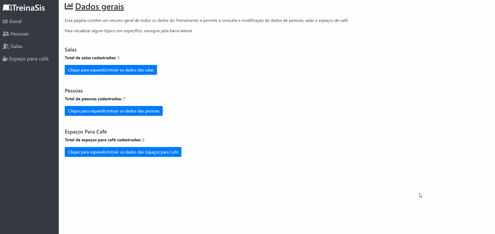
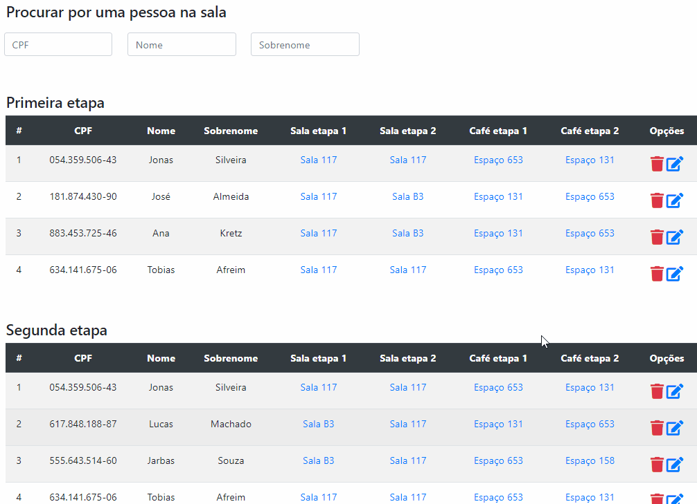
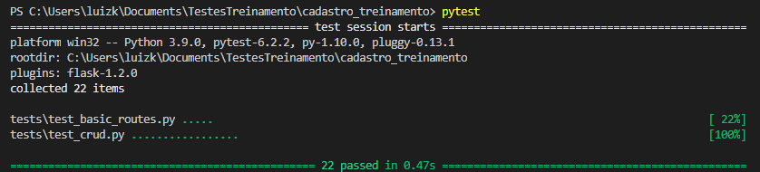
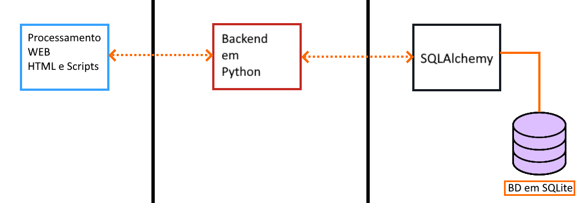

# Cadastro para Treinamento
[](https://www.python.org/)
[](https://www.javascript.com/)
[](https://github.com/ellerbrock/open-source-badges/) 

📜 Descrição do projeto

O projeto possibilita o cadastro de pessoas, salase espaços para café de um evento, seguindo alguns requisitos como lógica de organização e fazendo sua manutenção de maneira automática. Veja mais sobre esses requisitos e lógicas abaixo.

A lógica do projeto roda prioritariamente em Python, com requerimentos dade dados pela parte gráfica, a qual optei por desenvolver em um ambiente WEB com JavaScript e jQuery, uma vez que me sinto mais confortável e não tenho experiência com *frameworks* de criação de telas para aplicações em Java.

## 🛠 Instalação
  
Para rodar o servidor backend, basta instalar os pacotes necessário, todos listados no arquivo requirements.txt.
O mesmo pode ser feito com pip em um terminal na pasta fonte do projeto através do comando :

```sh
python -m pip install -r backend/requirements.txt
```

Para acessar os dados pelo frontend, basta executar qualquer um dos arquivos .html presentes em ˋfrontend/htmlˋ, **cerifique-se que o servido backend está rodando para obter os dados!**.

## 💻 Utilização

Para inicilizar o servidor backend, basta apenas inicilizar o módulo servidor_backend.py e o servidor irá rodar por padrão no *localhost*.

O acesso do usuário é feito pelo ambiente web ao se executar os arquivos html, vide explicação anterior.
Uma vez no site, pode-se navegar tanto pelos links na tela como pela barra de acesso rápido na lateral esquerda.

> O Site funciona de maneira responsiva, logo, se adapta ao tamanho da tela e acessos em dispositivos mobile.


### 🔍Consulta de dados
Em vários locais no sistema, você pode informar os dados desejados para consultar dados de pessoas, salas ou espaços de café em tempo real.


## 📈 Lógica de distribuição


### 🚪Salas
O sistema segue uma lógica para a distruibuição de pessoas nas salas:
  * A diferença de pessoas não pode ser maior que um
  * Metade das pessoas devem trocar de sala na segunda etapa
  > 💡 No caso da sala possuir um número impar de pessoas na primeira etapa, a metade é aredondada para baixo. Exemplo: metade de 3 pessoas = ~~1.5~~ 1
  
### ☕Espaços para café
  * A pessoa deve trocar de espaço para café entre o primeiro e segundo intervalo
  
Logo, um algoritmo garante que tais parâmetros sejam respeitados, organizando automaticamente as pessoas. 
Exemplo da parte principal do código responsável por realocar as pessoas nas salas e espaços para café, dando prioridade para seus lugares na primeira etapa:
~~~python
for pessoa in pessoas:
        
#Tenta inicialmente alocar a pessoa em sua sala original da primeira etapa
if not(alocar_pessoa_sala(pessoa.sala1_id,pessoa.cpf,1)):
    alocada = False
    #Caso de errado, tenta a proxima elegivel
    for sala in salas:
        if not(alocada):
            if( (alocar_pessoa_sala(sala.id_sala,pessoa.cpf,1)) ):
                alocada = True
                continue

if not(alocar_pessoa_cafe(pessoa.cafe1_id,pessoa.cpf,1)):
    alocadacafe = False
    for cafe in cafes:
        if not(alocadacafe):
            if (alocar_pessoa_cafe(cafe.id_espaco_cafe,pessoa.cpf,1)):
                print(pessoa.nome,cafe.nome)
                alocadacafe = True
                continue

~~~
## 🧪 Teste unitários
Os testes unitário são realizados utilizando a biblioteca Pytest em uma instância separada da aplicação e do banco de dados para evitar conflitos com a produção.
Todos os parâmetros para os mesmos são definidos na pasta tests, o que faz também com que para vizualizar os resultados de todos basta digitar **pytest** no prompt de comando, estando na pasta raiz do repositório(uma vez com a biblioteca instalada).


## 🗃 Persistência de dados

Os dados do programa são armazenados em um banco de dados utilizando a biblioteca SQAlchemy e SQLite e acessados e modificados através de *requests* no back-end.
> Um banco de dados chamado "testes.db" é utilizado apenas durante os testes unitários.

## 🧅 Camadas do projeto

O sistema é dividido em duas partes principais para torna-lo mais modular e seguro, sendo o processamento feito no back-end através da utilização de Python e algumas bibliotecas, principalmente Flask, enquanto o front-end é populado pelos dados obtidos do back-end através de requisições Ajax pelo jQuery e tem sua lógica de exposição baseada em JavaScript e jQuery.



